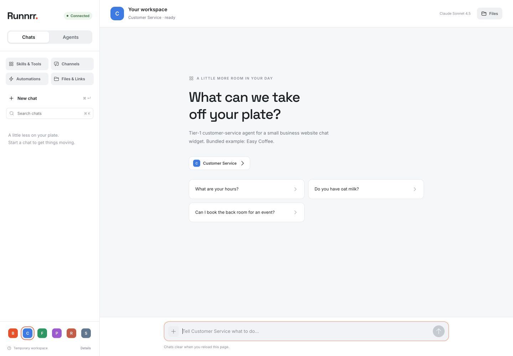

# Runnrr

A workstation for business agents, backed by a portable Python runtime.
Choose an agent, give it a task, and follow its response and tool activity in one place.

Runnrr currently supports live streaming chat, configured agent profiles,
read-only knowledge tools, skills, web research, and usage accounting. The web
workstation is served by the runtime itself. Conversations, pins, and drafts
are temporary and clear when the page reloads; server restarts or inactivity
can reset conversation context too.



## Quick start

This checkout lives at `~/programming-projects/Runnrr`. Python 3.13 is pinned in
`.python-version` (supported range: 3.11–3.13).

```bash
uv sync --frozen --extra dev --extra rag
cp .env.example .env
```

Add a provider key to `.env` and choose its model with `DEFAULT_MODEL`.
Supported provider keys include `ANTHROPIC_API_KEY`, `OPENAI_API_KEY`,
`DEEPSEEK_API_KEY`, `MOONSHOT_API_KEY`, and `GEMINI_API_KEY`.
Keys stay on the server. `TAVILY_API_KEY` enables web search.

```bash
.venv/bin/python -m uvicorn runnrr.app:app --host 127.0.0.1 --port 8001
```

Open **http://127.0.0.1:8001**. No frontend build or separate web server is required.
After frontend edits, reload the page. Add `--reload` for backend development.

## Workstation

- **Chats:** streaming Markdown, tool activity, source labels, token usage,
  temporary conversation switching, search, and pins.
- **Agents:** real profiles advertised by the runtime. Set `DEFAULT_PROFILE`
  in `.env` to choose the initial agent.
- **Skills & Tools:** inspect capabilities configured for the selected agent.
- **Files & Links:** inspect source metadata from conversations in this page.
- **Channels and Automations:** visible previews with unavailable states.

Agent creation, editing capabilities, attachments, file generation/previews,
voice, approvals, messaging, scheduled work, authentication, and durable
history are not implemented in the workstation yet. No actions are simulated
as successful. The original supplied design is preserved in [docs/design/](docs/design/).

The former dashboard, builder, and eval pages have been removed. Their backend
APIs and eval CLI remain available. The builder write API is still disabled
by default (`ENABLE_PROFILE_EDITOR=0`).

## Bundled agents

| Profile | Purpose |
| --- | --- |
| `personal-agent` | Candidate/resume assistant using a local knowledge base; current default |
| `customer-service` | Coffee-shop support example with a bundled knowledge base |
| `research-analyst` | Public research, page fetching, and calculations |
| `sales-concierge` | Catalog lookup, lead qualification, and checkout previews |
| `bzs-concierge` | Workflow-consulting discovery and lead previews |
| `frampton` | Dark Souls guide using bundled public wiki material |

Profiles gate which tools an agent can use. Sales tools are previews: they do
not persist leads to a CRM or charge customers. New business profiles can be
added without changing the engine.

## Add an agent

Create `profiles/<id>/profile.json` and a `system.md` prompt. For example:

```json
{
  "id": "my-agent",
  "label": "My Agent",
  "description": "Answers questions about our business",
  "kb_root": "kb/my-agent",
  "system_prompt_path": "profiles/my-agent/system.md",
  "tools": ["list_kb", "read_file", "search_kb"]
}
```

Plain-English procedures live at `profiles/<id>/skills/<slug>/SKILL.md`, with
`name` and `description` frontmatter. Their bodies are loaded as tool results,
keeping the model's system prompt stable for caching. MCP configuration is
parsed but no MCP client connects yet.

## Knowledge and evaluations

Semantic retrieval is opt-in through the `semantic_search_kb` tool. Build a
profile index explicitly after changing its knowledge base:

```bash
.venv/bin/python -m runnrr.rag.cli build customer-service
.venv/bin/python -m runnrr.rag.cli info customer-service
.venv/bin/python -m runnrr.rag.cli query customer-service "opening hours" --k 3
```

Voyage embeddings require `VOYAGE_API_KEY`. Tests use deterministic fixtures.
Indexes live under `profiles/<id>/.index/` and are ignored by Git. Chat never
rebuilds an index automatically; restart the runtime after rebuilding.

```bash
.venv/bin/python -m runnrr.evals.cli --backend fake run customer-service \
  --mode retrieval-only --variants keyword,hybrid --k 5
.venv/bin/python -m runnrr.evals.cli list customer-service
```

Evaluation datasets live with profiles and outputs are ignored under
`profiles/<id>/evals/runs/`. `ENABLE_EVALS_API=1` enables the read-only eval endpoints.

## Validation

```bash
.venv/bin/python -m pytest -q
node tests/workstation.mjs
```

The frontend check uses Node's built-in assertions; no npm install is needed.
Visual verification is recorded in [design-qa.md](design-qa.md).

## Architecture and privacy

FastAPI exposes `/api/chat` as SSE and read-only profile, model, health,
budget, tool, retrieval, and evaluation endpoints. Anthropic, OpenAI-compatible,
and Gemini adapters share one agent loop. Sessions and the daily budget live
in process memory, so run a single worker.

Only `web/` is served as public static content. `.env`, profiles, local KBs,
and Git metadata are not web assets. Private knowledge, resumes, codebase
dumps, and credentials stay ignored. `kb/frampton/` is the exception: it
contains public third-party wiki material.

The product direction is one runtime per business with authenticated access,
durable sessions, a writable workspace, and business integrations. Those are
future backend work, tracked in [the implementation sequence](docs/plans/runnrr-analysis.md).

## Contributing and deployment

See [CONTRIBUTING.md](CONTRIBUTING.md), [AGENTS.md](AGENTS.md), and
[history.md](history.md). Deployment remains manual; see [deploy/README.md](deploy/README.md).
The separate frozen public-site deployment is not changed by this repository.

## License

[MIT](LICENSE). Vendored frontend assets retain their [upstream licenses](web/vendor/README.md).
