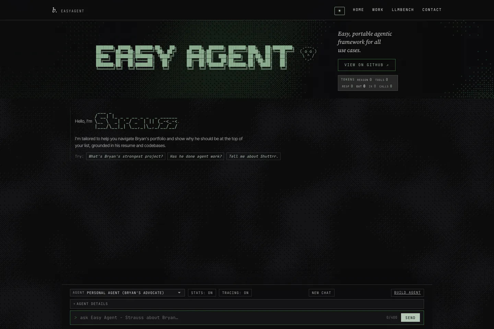

# Runnrr

A workstation for business agents, backed by a portable Python runtime.
Choose an agent, give it a task, and follow its response and tool activity in one place.



*The deployed [EasyAgent showcase](https://bryanzane.com/easyagent/). Its UI differs from the current Runnrr workstation in this checkout.*

Regenerate: `cd docs/screenshots && npm ci && npx playwright install chromium && npm run capture`
(Node.js, network access, and `cwebp` required; captures the live site).

Runnrr currently supports live streaming chat, configured agent profiles,
read-only knowledge tools, skills, web research, and usage accounting. The web
workstation is served by the runtime itself. Conversations, pins, and drafts
are temporary and clear when the page reloads; server restarts or inactivity
can reset conversation context too.

## Quick start

Python 3.13 is pinned in
`.python-version` (supported range: 3.11–3.13).

```bash
uv sync --frozen --extra dev --extra rag
cp .env.example .env
```

Add a provider key to `.env` and choose its model with `DEFAULT_MODEL`.
Supported provider keys include `ANTHROPIC_API_KEY`, `OPENAI_API_KEY`,
`DEEPSEEK_API_KEY`, `MOONSHOT_API_KEY`, and `GEMINI_API_KEY`.
Keys stay on the server. `TAVILY_API_KEY` enables web search.

```bash
.venv/bin/python -m uvicorn runnrr.app:app --host 127.0.0.1 --port 8001
```

Open **http://127.0.0.1:8001**. No frontend build or separate web server is required.
After frontend edits, reload the page. Add `--reload` for backend development.

## Workstation

- **Chats:** streaming Markdown, tool activity, source labels, token usage,
  temporary conversation switching, search, and pins.
- **Agents:** real profiles advertised by the runtime. Set `DEFAULT_PROFILE`
  in `.env` to choose the initial agent.
- **Skills & Tools:** inspect capabilities configured for the selected agent.
- **Files & Links:** inspect source metadata from conversations in this page.
- **Channels and Automations:** visible previews with unavailable states.

Agent creation, editing capabilities, attachments, file generation/previews,
voice, approvals, messaging, scheduled work, authentication, and durable
history are not implemented in the workstation yet. No actions are simulated
as successful. The original supplied design is preserved in [docs/design/](docs/design/).

The former dashboard, builder, and eval pages have been removed. Their backend
APIs and eval CLI remain available. The builder write API is still disabled
by default (`ENABLE_PROFILE_EDITOR=0`).

## Validation

```bash
.venv/bin/python -m pytest -q
node tests/workstation.mjs
```

The frontend check uses Node's built-in assertions; no npm install is needed.
Visual verification is recorded in [design-qa.md](design-qa.md).

## Architecture and privacy

FastAPI exposes `/api/chat` as SSE and read-only profile, model, health,
budget, tool, retrieval, and evaluation endpoints. Anthropic, OpenAI-compatible,
and Gemini adapters share one agent loop. Sessions and the daily budget live
in process memory, so run a single worker.

Only `web/` is served as public static content. `.env`, profiles, local KBs,
and Git metadata are not web assets. Private knowledge, resumes, codebase
dumps, and credentials stay ignored. `kb/frampton/` is the exception: it
contains public third-party wiki material.

The product direction is one runtime per business with authenticated access,
durable sessions, a writable workspace, and business integrations. Those are
future backend work, tracked in [the implementation sequence](docs/plans/runnrr-analysis.md).

## Documentation

- [Bundled agents](docs/guide.md#bundled-agents)
- [Add an agent](docs/guide.md#add-an-agent)
- [Knowledge and evaluations](docs/guide.md#knowledge-and-evaluations)

## Contributing and deployment

See [CONTRIBUTING.md](CONTRIBUTING.md), [AGENTS.md](AGENTS.md), and
[history.md](history.md). Deployment remains manual; see [deploy/README.md](deploy/README.md).
The separate frozen public-site deployment is not changed by this repository.

## License

[MIT](LICENSE). Vendored frontend assets retain their [upstream licenses](web/vendor/README.md).
